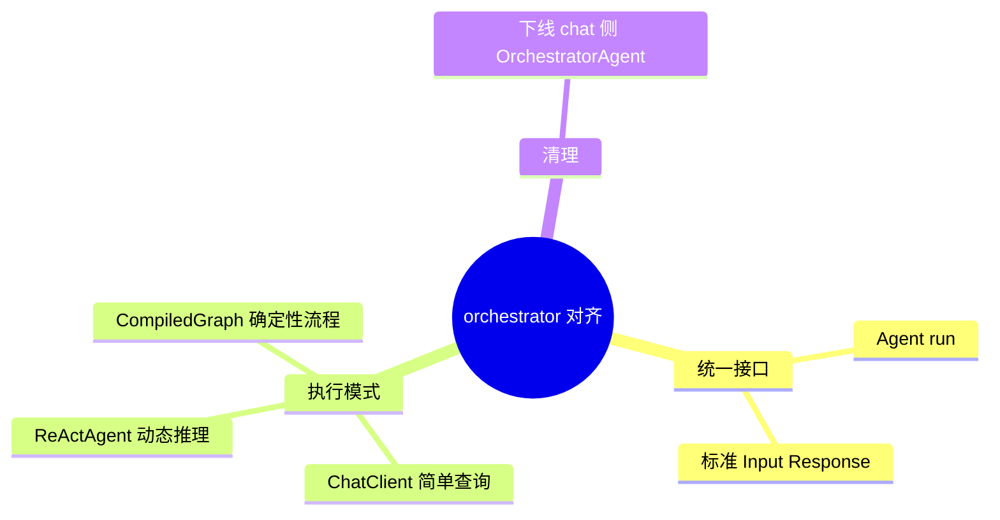

# 子 Agent 编排规范对齐

## Agent Hub / 存量编排对齐四层规范 需求说明（前提/操作/结果）
> 将存量 Orchestrator/SubAgent 路径对齐平台四层架构：子 Agent 统一 `Agent` 接口，内部按需选用 ChatClient / ReActAgent / CompiledGraph；废弃 chat 路径对手写 Orchestrator 的依赖。
> 交付阶段：**P1** 对齐接口与主路径；与 `aether-agent/agent-chat` 存量 spec 协同，本 spec 聚焦**平台级子 Agent 抽象**。

---

## Requirements
（存量能力平台化——目标行为）

### 功能组 1：统一 Agent 抽象

### Requirement: 1. 子 Agent 统一接口 [P1]

系统应当（SHALL）使所有子 Agent 实现统一 Agent 接口；入参与出参包含 sessionId、tenantId、intent、payload、contextSnapshot、metadata、statusCode、errorInfo 等标准字段。

#### 场景: 子 Agent 被总路由调用
- **前提**：总路由选中某子 Agent。
- **操作**：传递标准 AgentInput。
- **结果**：子 Agent 返回标准 AgentResponse；字段完整可序列化。

---

### Requirement: 2. 子 Agent 内部执行模式选型 [P1]

系统应当（SHALL）允许子 Agent 内部按场景选择：简单查询用 ChatClient 直调原子 Tool；复杂动态推理用 ReActAgent；确定性多步流程用 CompiledGraph；选型理由在 design 中按 Agent 逐一说明。

#### 场景: 简单查天气
- **前提**：客服子 Agent 收到单一 factual 查询。
- **操作**：子 Agent 处理请求。
- **结果**：走 ChatClient + 单 Tool，无多轮 ReAct 循环。

#### 场景: 多步审批流程
- **前提**：业务子 Agent 收到需条件分支与人工确认的流程。
- **操作**：子 Agent 处理请求。
- **结果**：走 CompiledGraph；含审批挂起节点能力（P2 完整 HIL）。

---

### Requirement: 3. 下线 chat 路径 OrchestratorAgent [P1]

系统应当（SHALL）使 `/chat/agent` 主路径不再调用存量 `OrchestratorAgent.process`；编排职责由总路由 Agent + 子 Agent 承担。

#### 场景: 智能体对话主路径
- **前提**：用户通过 chat/agent 发起对话。
- **操作**：追踪调用栈或集成测试。
- **结果**：无 OrchestratorAgent 参与；经总路由 → 子 Agent 链路完成。

---

### Requirement: 4. 原子 Tool 标准返回 [P1]

系统应当（SHALL）使所有原子 Tool 返回统一结构：success、data、errorCode、errorMessage；失败时不抛出未捕获异常中断 Agent。

#### 场景: Tool 业务失败
- **前提**：外部 API 返回业务错误。
- **操作**：子 Agent 调用该 Tool。
- **结果**：ToolResult.success=false，含 errorCode/errorMessage；Agent 可继续推理或友好回复用户。

---

### 功能组 2：Text2SQL 路由（P4）

### Requirement: 5. 数据分析意图路由至 text2sql 能力 [P4]

系统应当（SHALL）使总路由或数据分析子 Agent 能识别统计、报表、SQL 查询类意图，并路由至 text2sql Skill 或等价子 Agent；不得将 text2sql 所需底层 schema/执行工具直接暴露给总路由。

#### 场景: 用户询问业务统计
- **前提**：用户提问「本月各租户 API 调用次数排行」。
- **操作**：发起 SuperAgents 智能体对话。
- **结果**：路由至数据分析/text2sql 路径；总路由仅暴露子 Agent transfer，不直接调用 schema 或 execute 类底层工具。

---

### Requirement: 6. text2sql 多轮确认会话上下文 [P4]

系统应当（SHALL）在 text2sql 待确认、修改或挂起阶段保持会话级编排上下文，使后续用户消息能继续同一 SQL 流程而不被误判为全新无关意图。

#### 场景: 确认阶段用户补充条件
- **前提**：当前会话处于 text2sql SQL 草案待确认状态。
- **操作**：用户发送「加上按日期分组」。
- **结果**：编排层识别为同一 text2sql 流程的修改请求；不会重新走无关子 Agent 路由。

---
