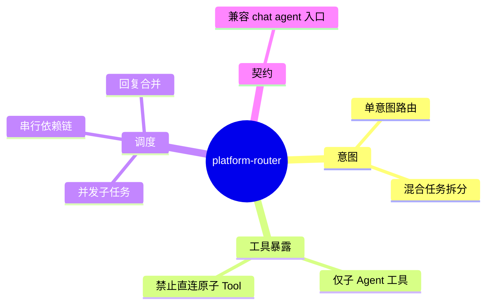

# 四层总路由 Agent

## Agent Hub / 平台总路由 需求说明（前提/操作/结果）
> 平台第一层：轻量 ChatClient + 工具调用，**仅**暴露子 Agent 工具（从注册中心动态发现），不直连底层原子 Tool。职责：意图识别、混合任务拆分、并发/串行调度、回复合并。
> 交付阶段：**P1**（内核）。范围外：子 Agent 内部推理细节（见 collaboration / skill-engine spec）。

---

## Requirements

### 功能组 1：路由与工具边界

### Requirement: 1. 总路由仅暴露子 Agent 工具 [P1]

系统应当（SHALL）使总路由 Agent 的工具列表**仅**包含从 Agent 注册中心发现的子 Agent 工具；总路由不得直接注册或调用底层原子 Tool（如天气、数据库查询等）。

#### 场景: 注册中心有 3 个子 Agent
- **前提**：注册中心存在客服、数据分析、代码生成三个活跃子 Agent。
- **操作**：总路由 Agent 初始化或刷新工具列表。
- **结果**：工具列表恰好 3 项，均为子 Agent 入口；无原子 Tool 出现在总路由工具集中。

#### 场景: 用户请求需底层 Tool
- **前提**：用户问题需调用天气等原子 Tool。
- **操作**：总路由识别意图并路由至合适子 Agent。
- **结果**：原子 Tool 由子 Agent 内部调用；总路由不越层直连。

---

### Requirement: 2. 意图识别与单域路由 [P1]

系统应当（SHALL）对用户输入进行意图识别，并将单域请求路由至最匹配的子 Agent；路由结果对用户可见（如 SSE 前缀或 AgentProgress 事件）。

#### 场景: 明确客服意图
- **前提**：用户输入为订单/售后类问题。
- **操作**：发起平台对话。
- **结果**：总路由选择客服子 Agent；用户可见路由摘要指明目标 Agent。

#### 场景: 无明确垂直域
- **前提**：用户输入为通用问答。
- **操作**：发起平台对话。
- **结果**：总路由选择默认/通用子 Agent 或编排路径；不报错中断。

---

### 功能组 2：混合任务与合并

### Requirement: 3. 无关混合任务拆分 [P2]

系统应当（SHALL）支持用户在一轮输入中提出多个**互不依赖**的子任务时，总路由将其拆分为独立子任务并**并发**调度对应子 Agent，最终将各子 Agent 回复合并为统一答案返回。

#### 场景: 双域并行问题
- **前提**：用户同时问「查订单状态」和「分析上月销售趋势」。
- **操作**：发起对话。
- **结果**：总路由拆为 2 个子任务并发执行；最终回复包含两部分结构化内容，顺序可配置但内容完整。

#### 场景: 有依赖的串行任务
- **前提**：用户第二问依赖第一问结果（如「基于上面分析给出建议」）。
- **操作**：发起对话。
- **结果**：总路由识别依赖关系，按序调度；不错误并发。

---

### Requirement: 4. 对话入口兼容 [P1]

系统应当（SHALL）通过现有智能体对话入口（`POST /api/agent-hub/chat/agent`）接入总路由能力；成功路径下 HTTP 路径与请求体结构保持与调用方兼容（非 BREAKING），内部实现切换为四层总路由。

#### 场景: Nebula Desk 无改动联调
- **前提**：前端使用存量 chat/agent 契约。
- **操作**：发送非空 message。
- **结果**：HTTP 200 + SSE 流式文本；调用方无需改 URL 或字段名。

---

