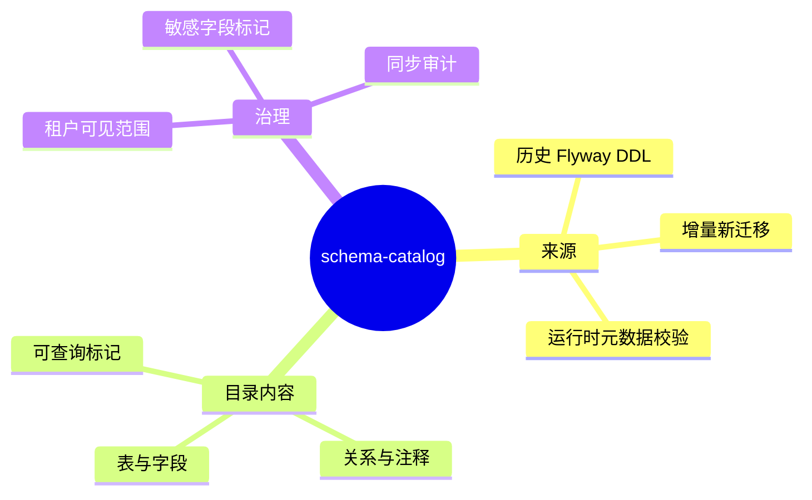

# Schema Catalog（Text2SQL 表结构目录）

## Agent Hub / Schema Catalog 需求说明（前提/操作/结果）
> 为 text2sql 提供基于 Flyway 迁移与运行时数据库元数据的表结构识别目录；历史与未来 DDL 均可被识别并纳入可查询范围。
> 详见 proposal「Schema Catalog」节点。

---

## Requirements
（新增用户故事）

### 功能组 1：目录构建与同步

### Requirement: 1. 识别历史 Flyway 建表与改表语句

系统应当（SHALL）扫描项目全部历史 Flyway 迁移脚本，识别建表、改表、索引、约束与表/字段注释，并纳入 Schema Catalog 初始目录。

#### 场景: 首次初始化目录
- **前提**：平台已存在多版本 Flyway 迁移且数据库已执行完毕。
- **操作**：触发 Schema Catalog 初始化。
- **结果**：目录包含迁移中出现的全部业务表、字段、类型与注释摘要；每条记录可追溯到来源迁移版本。

---

### Requirement: 2. 增量同步新增或变更的 Flyway 迁移

系统应当（SHALL）在后续新增或变更 Flyway 迁移执行成功后，自动增量更新 Schema Catalog；已处理迁移须记录版本与校验信息，避免重复解析。

#### 场景: 新迁移上线后同步
- **前提**：Catalog 已初始化；团队新增一条改表迁移并成功执行。
- **操作**：应用启动或定时同步任务运行。
- **结果**：Catalog 新增或更新对应表/字段；未变更的历史条目保持不变。

---

### Requirement: 3. 以运行时数据库元数据校验目录事实

系统应当（SHALL）以当前数据库实际元数据校验 Flyway 解析结果；当解析结果与运行时结构不一致时，以运行时结构为准并记录差异，供运维排查。

#### 场景: 迁移脚本与库结构不一致
- **前提**：某字段在迁移脚本中存在但运行库中已被手工调整。
- **操作**：执行 Catalog 同步。
- **结果**：Catalog 展示运行库真实结构；差异被记录且不影响 text2sql 使用最新事实。

---

### 功能组 2：可查询范围与租户隔离

### Requirement: 4. 标记 text2sql 可查询表与字段

系统应当（SHALL）为 Catalog 中的表与字段提供「是否允许 text2sql 查询」标记；默认仅开放经治理确认的业务查询对象，敏感或系统内部对象默认不可查询。

#### 场景: 敏感表默认不可查
- **前提**：Catalog 含审计日志、密钥配置等敏感表。
- **操作**：text2sql 检索可用 schema。
- **结果**：敏感表不在默认可查询列表中；除非经授权显式开放。

---

### Requirement: 5. 租户范围内的 Schema 可见性

系统应当（SHALL）使 Schema Catalog 检索与 text2sql 生成仅返回当前租户有权访问的表与字段；跨租户 schema 不可见。

#### 场景: 多租户用户发起统计问题
- **前提**：租户 A 与租户 B 各自拥有独立业务数据域。
- **操作**：租户 A 用户询问「本月调用量」并触发 schema 检索。
- **结果**：Catalog 仅返回租户 A 可访问对象；生成 SQL 时强制包含租户隔离条件。

---

### Requirement: 6. 为 text2sql 提供语义检索入口

系统应当（SHALL）允许 text2sql 按用户自然语言问题检索最相关的表、字段与关系说明，用于 SQL 草案生成；检索结果须含业务含义摘要而非仅裸列名。

#### 场景: 用户询问跨表指标
- **前提**：用户提问「各租户 trace 调用次数」。
- **操作**：text2sql 调用 schema 检索。
- **结果**：返回与 trace、租户、调用统计相关的表字段及关系说明，供后续 SQL 生成使用。

---
