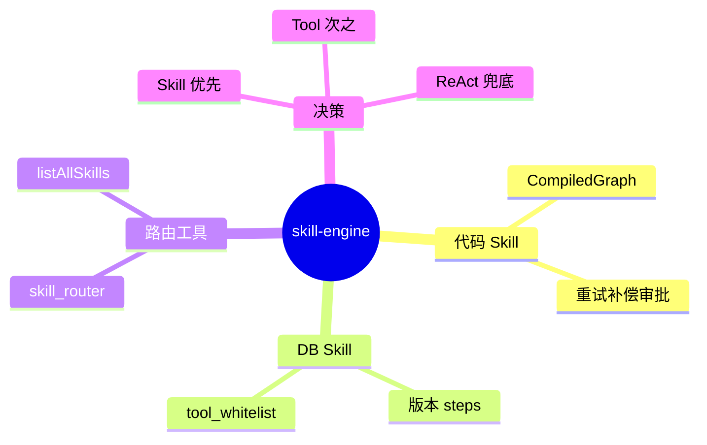

# Skill 混合引擎

## Agent Hub / Skill 机制 需求说明（前提/操作/结果）
> 代码 Skill（CompiledGraph）+ 数据库提示词 Skill + skill_router 工具；子 Agent 决策：匹配 Skill → 调用；简单查询 → 原子 Tool；复杂无 Skill → ReAct 自主组合。
> 交付阶段：**P2**（内核接口 P1 可占位）。详见 proposal `aether-agent/skill-engine`。

---

## Requirements

### Requirement: 1. 代码 Skill 作为可调用 Tool [P2]

系统应当（SHALL）将以 CompiledGraph 实现的代码 Skill 注册为普通 Tool，供 ReActAgent 或子 Agent 调用；图内支持重试、超时与补偿回滚。

#### 场景: ReAct 选中代码 Skill
- **前提**：存在「订单取消流程」代码 Skill。
- **操作**：子 Agent ReAct 循环匹配该 Skill。
- **结果**：Skill 作为 Tool 被调用；Graph 执行完毕返回 ToolResult。

---

### Requirement: 2. 数据库提示词 Skill 存储与版本 [P2]

系统应当（SHALL）在数据库持久化提示词 Skill（名称、描述、步骤 JSON、工具白名单、版本、状态）；修改 Skill 须生成新版本，旧版本保留可回滚。

#### 场景: 更新 Skill 步骤
- **前提**：租户 A 存在 active Skill「退款指引」v1。
- **操作**：管理员修改步骤并发布。
- **结果**：生成 v2；v1 保留；灰度规则可指定活跃版本。

---

### Requirement: 3. skill_router 执行 DB Skill [P2]

系统应当（SHALL）提供 skill_router 工具：按技能名加载 DB 步骤并在 ReAct 循环内逐步执行；技能名不存在时返回可用技能列表提示。

#### 场景: 按名调用 DB Skill
- **前提**：DB 存在 active Skill「退款指引」。
- **操作**：ReAct 调用 skill_router("退款指引")。
- **结果**：按 steps 顺序执行；每步仅可使用 tool_whitelist 内工具。

#### 场景: 技能名不存在
- **前提**：无名为「未知流程」的 Skill。
- **操作**：调用 skill_router("未知流程")。
- **结果**：返回失败 ToolResult + 可用 Skill 名称列表。

---

### Requirement: 4. 子 Agent Skill 决策优先级 [P2]

系统应当（SHALL）使子 Agent 按优先级决策：匹配 Skill（代码或 DB）→ 调用；无 Skill 的简单查询 → 原子 Tool；复杂且无 Skill → ReAct 自主组合 Tool。

#### 场景: 命中 DB Skill
- **前提**：用户意图匹配「退款指引」Skill。
- **操作**：子 Agent 处理请求。
- **结果**：优先走 skill_router，不走无关 ReAct 盲调。

---

### Requirement: 5. DB Skill 安全白名单 [P2]

系统 shall 对每个 DB Skill 强制绑定 tool_whitelist；执行时仅允许白名单内工具被调用；入库内容须清洗，禁止可执行代码片段。

#### 场景: 步骤尝试调用非白名单 Tool
- **前提**：Skill 白名单仅含「查询订单」。
- **操作**：步骤配置要求调用「删除订单」。
- **结果**：执行被阻断；返回安全错误；审计记录。

---

