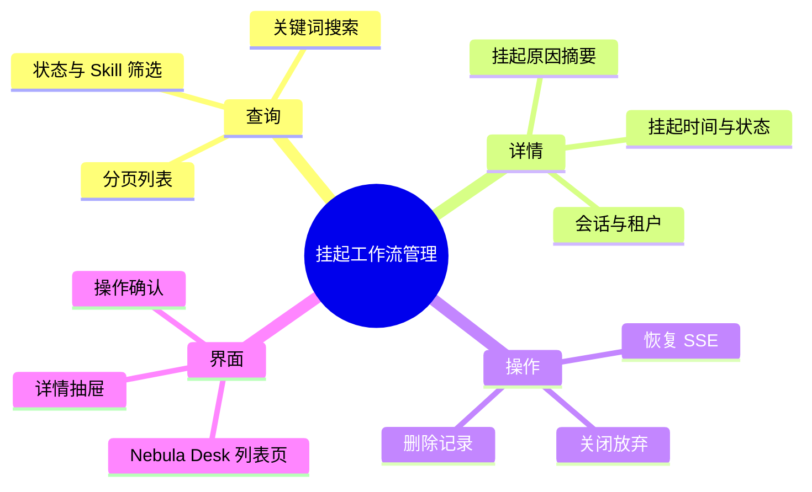

# SuperAgents 挂起工作流管理

## SuperAgents / 异步工作流 需求说明（前提/操作/结果）
> 当 CompileGraph 人工审批（HIL）等节点将工作流挂起时，平台生成可恢复的挂起记录。本能力补齐**可观测与管理面**：运维与业务人员可在控制台查看挂起列表、搜索筛选、审阅详情，并执行恢复、关闭或删除；管理类 REST 接口统一由 Webhook 控制器暴露，与既有 `POST /hooks/resume` 恢复入口形成闭环。
> 挂起触发与 Graph Interrupt 机制不在本能力范围内变更。详见变更 `add-suspended-workflow-management`。

---

## Requirements

### 功能组 1：挂起记录查询

### Requirement: 1. 分页查看挂起工作流列表

系统应当（SHALL）允许授权用户按分页方式查看当前租户下处于可管理状态的工作流挂起记录；每条列表项至少展示会话标识、关联 Skill 名称、挂起状态、挂起时间与恢复令牌摘要（可脱敏展示）。

#### 场景: 打开挂起列表
- **前提**：用户已登录 Nebula Desk，SuperAgents 服务可用，存在至少一条挂起记录。
- **操作**：从 SuperAgents / Agent Hub 导航进入「挂起工作流」管理页。
- **结果**：页面展示分页列表；默认按挂起时间倒序；加载中显示占位态；无数据时展示空状态与说明。

#### 场景: 翻页浏览
- **前提**：挂起记录总数超过单页容量。
- **操作**：切换至下一页或修改每页条数。
- **结果**：列表按新分页参数刷新；分页信息与总数展示正确。

---

### Requirement: 2. 条件搜索与筛选挂起记录

系统应当（SHALL）支持通过关键词（会话标识、Skill 名称、恢复令牌片段）及状态、Skill 名称等筛选条件缩小列表范围。

#### 场景: 按关键词搜索
- **前提**：列表中存在多条挂起记录。
- **操作**：在搜索框输入已知会话标识或 Skill 名称片段并执行搜索。
- **结果**：列表仅展示匹配记录；无匹配时展示「无结果」提示而非报错。

#### 场景: 按状态筛选
- **前提**：存在不同状态的挂起记录（如挂起中、已恢复、已关闭）。
- **操作**：选择「仅挂起中」状态筛选。
- **结果**：列表仅展示仍处于挂起中、可被恢复或关闭的记录。

---

### Requirement: 3. 查看挂起工作流详情

系统应当（SHALL）允许用户查看单条挂起记录的完整业务详情，包括租户、会话、Skill、状态、挂起与恢复时间、待处理消息摘要及图状态中的非敏感关键字段。

#### 场景: 从列表打开详情
- **前提**：列表中存在一条挂起记录。
- **操作**：点击该行的「查看详情」。
- **结果**：以抽屉或详情区展示完整字段；敏感或过长内容截断展示并可展开；加载失败时提示可重试。

#### 场景: 记录不存在
- **前提**：用户持有已失效或过期的恢复令牌。
- **操作**：请求该记录详情。
- **结果**：返回明确的「未找到」业务错误；界面展示可读提示，不暴露内部堆栈。

---

### 功能组 2：挂起记录操作

### Requirement: 4. 恢复挂起的工作流

系统应当（SHALL）允许用户对状态为「挂起中」的记录发起恢复；恢复行为与既有 Webhook 恢复语义一致，以流式方式推送恢复进度与待处理消息。

#### 场景: 从管理页恢复
- **前提**：存在状态为挂起中的记录，用户具备操作权限。
- **操作**：在列表或详情中点击「恢复」并确认。
- **结果**：调用既有恢复接口；界面展示恢复进行中状态；成功后记录状态变为已恢复，会话挂起标记解除；失败时展示可读错误且记录状态不变。

#### 场景: 恢复非挂起中记录
- **前提**：目标记录已恢复或已关闭。
- **操作**：尝试再次恢复。
- **结果**：拒绝操作并提示当前状态不可恢复；不产生重复恢复副作用。

---

### Requirement: 5. 关闭挂起的工作流

系统应当（SHALL）允许用户对状态为「挂起中」的记录执行关闭，表示人工决定不再恢复执行；关闭后该记录不可再被恢复，且应解除会话层面的挂起标记。

#### 场景: 成功关闭
- **前提**：存在挂起中的记录。
- **操作**：点击「关闭」并在二次确认后提交。
- **结果**：记录状态变为已关闭；会话挂起标记解除；列表与详情同步更新。

#### 场景: 关闭已恢复记录
- **前提**：记录已恢复。
- **操作**：尝试关闭。
- **结果**：拒绝操作并提示状态不允许关闭。

---

### Requirement: 6. 删除挂起记录

系统应当（SHALL）允许用户删除指定的挂起记录（用于运维清理历史数据）；删除须二次确认；仅允许删除已关闭或已恢复的记录，或 design 定稿的等价策略。

#### 场景: 删除历史记录
- **前提**：存在已关闭或已恢复的历史挂起记录。
- **操作**：点击「删除」并确认。
- **结果**：记录从列表中移除且不可再查询；操作成功给出轻量反馈。

#### 场景: 删除仍挂起中的记录
- **前提**：记录仍处于挂起中。
- **操作**：尝试直接删除。
- **结果**：默认拒绝并提示须先关闭或恢复；若 design 允许强制删除，须额外高危确认（design 定稿）。

---

### 功能组 3：接口与租户边界

### Requirement: 7. Webhook 控制器统一管理接口

系统应当（SHALL）将挂起工作流的列表、搜索、详情、关闭、删除等管理类 HTTP 接口与既有恢复接口一并置于 SuperAgents Webhook 控制器下，路径前缀与平台 SuperAgents API 一致。

#### 场景: 管理接口与恢复接口共存
- **前提**：后端已部署本能力。
- **操作**：分别调用列表、详情、关闭、删除及恢复接口。
- **结果**：各接口按契约返回；恢复接口行为与变更前兼容，现有外部 Webhook 集成无需修改调用方式。

---

### Requirement: 8. 租户隔离与权限

系统应当（SHALL）仅返回与请求租户标识匹配的挂起记录；写操作（恢复、关闭、删除）须校验记录归属租户，跨租户操作被拒绝。

#### 场景: 跨租户访问被拒绝
- **前提**：租户 A 存在挂起记录，用户以租户 B 身份请求该记录详情或操作。
- **操作**：携带租户 B 标识访问租户 A 的记录。
- **结果**：返回未找到或未授权类业务错误；不泄露他租户记录存在性细节。

---

### 功能组 4：前端体验与非破坏性

### Requirement: 9. Nebula Desk 管理页面

系统应当（SHALL）在 ai_react（Nebula Desk）新增挂起工作流管理页面，提供列表、搜索筛选、详情查看及恢复/关闭/删除操作；视觉与 Agent Hub 现有 SuperAgents 运维页风格一致（`uiCraftMode: auto` 命中时走 Impeccable 验收）。

#### 场景: 导航可达
- **前提**：用户已登录 Nebula Desk。
- **操作**：从 Agent Hub / SuperAgents 相关导航进入挂起工作流页。
- **结果**：路由可达；页面标题与 i18n 文案完整；不影响既有对话页、Skill 管理台等页面。

#### 场景: 操作反馈与防误触
- **前提**：用户执行关闭或删除。
- **操作**：点击危险操作按钮。
- **结果**：弹出二次确认；操作中按钮禁用防重复提交；完成后 Toast 或等价反馈。

---

### Requirement: 10. 不破坏既有挂起与恢复主路径

系统应当（SHALL）保持 `WorkflowSuspendService` 挂起写入与 Graph HIL 节点触发逻辑不变；既有 `POST /hooks/resume` 的请求体、SSE 响应语义与外部集成方式保持向后兼容。

#### 场景: 外部 Webhook 恢复不受影响
- **前提**：外部系统已集成 resumeToken 回调恢复。
- **操作**：在本能力上线后，外部系统继续按原方式调用恢复接口。
- **结果**：恢复流程与响应格式与变更前一致；挂起 token 生成规则不变。

---
