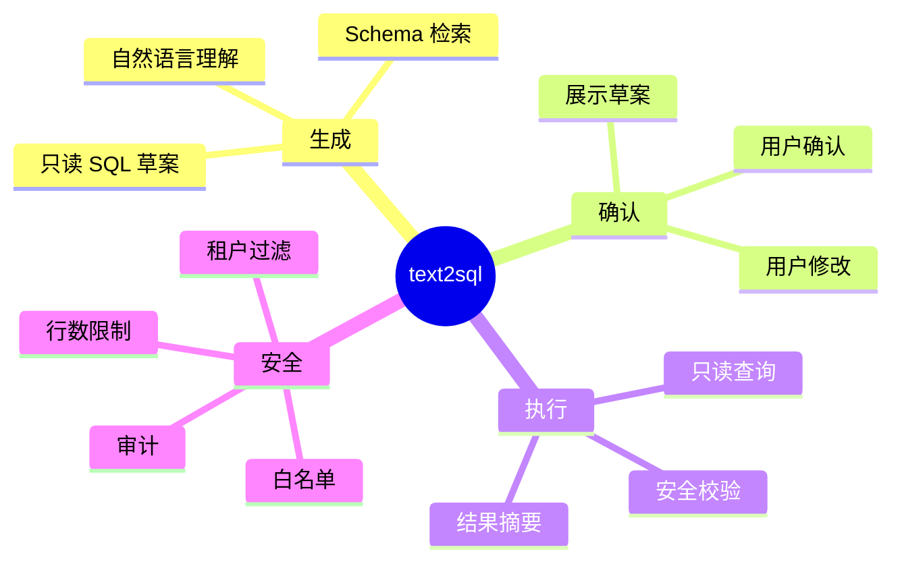

# Text2SQL 只读查询 Skill

## Agent Hub / Text2SQL 需求说明（前提/操作/结果）
> 支持 SuperAgents 数据分析场景：基于 Schema Catalog 生成只读 SQL 草案，经用户确认或修改后安全执行，并返回结构化结果与自然语言摘要。
> 详见 proposal「Text2SQL Skill」节点；与 `aether-agent/schema-catalog`、`aether-integration/chat-artifacts` 协同。

---

## Requirements
（新增用户故事）

### 功能组 1：SQL 草案与多轮确认

### Requirement: 1. 基于 Schema Catalog 生成只读 SQL 草案

系统应当（SHALL）将用户数据分析类自然语言问题转换为只读 SQL 草案；草案须基于 Schema Catalog 中可查询对象生成，不得引用目录外或未授权对象。

#### 场景: 用户发起统计查询
- **前提**：用户具备 text2sql 权限；Catalog 已包含相关业务表。
- **操作**：用户提问「统计 default 租户本月各 skill 执行次数」。
- **结果**：系统生成只读 SQL 草案，包含租户条件、聚合逻辑与默认行数限制；尚未执行查询。

---

### Requirement: 2. 执行前必须经用户确认或修改

系统应当（SHALL）在 SQL 草案生成后进入待确认状态，向用户展示草案并询问是否确认执行或修改；未经确认或重新校验通过的 SQL 不得执行。

#### 场景: 用户确认执行
- **前提**：系统已展示 SQL 草案与口径说明。
- **操作**：用户回复「确认执行」。
- **结果**：系统进入安全校验与执行阶段；若用户回复「把 limit 改成 50」，则生成新草案并再次待确认。

#### 场景: 用户修改查询条件
- **前提**：系统已展示 SQL 草案。
- **操作**：用户要求「只看 active 状态，时间范围改为上周」。
- **结果**：系统基于修改意图更新 SQL 草案；仍保持待确认状态，直至用户明确确认。

---

### Requirement: 3. 多轮会话保持 SQL 草案上下文

系统应当（SHALL）在同一会话内保存当前 text2sql 流程的状态（问题、SQL 草案、确认状态、执行结果摘要），使用户可在多轮对话中继续确认、修改或重新执行，而不必重复描述原始问题。

#### 场景: 挂起后下一轮继续确认
- **前提**：上一轮已生成 SQL 草案但未执行。
- **操作**：用户在新一轮消息中发送「继续」或补充修改意见。
- **结果**：系统恢复当前草案上下文；不会丢失已生成 SQL 或用户修改记录。

---

### 功能组 2：安全执行与结果返回

### Requirement: 4. 执行前强制只读与安全校验

系统应当（SHALL）在用户确认后对 SQL 执行安全校验：仅允许只读查询；必须通过表/字段白名单；必须包含租户隔离条件；必须包含行数或分页上限；禁止 DDL/DML 与多语句注入。

#### 场景: 用户确认含删除语句的草案
- **前提**：模型误生成含 DELETE 的 SQL 且用户点击确认。
- **操作**：系统执行安全校验。
- **结果**：拒绝执行；向用户返回可读错误原因；不访问数据库。

#### 场景: 缺少租户条件的草案
- **前提**：SQL 草案未包含当前租户过滤条件。
- **操作**：系统执行安全校验。
- **结果**：拒绝执行或自动补全租户条件后再次待用户确认（口径在 design 中明确）。

---

### Requirement: 5. 返回结构化查询结果与自然语言摘要

系统应当（SHALL）在只读查询成功后返回结构化结果（列定义与行数据）及自然语言结果摘要；摘要须说明查询口径、行数与主要发现，便于非技术用户理解。

#### 场景: 查询成功返回表格
- **前提**：用户已确认合法 SQL 且校验通过。
- **操作**：系统执行查询。
- **结果**：返回表格化结果与自然语言摘要；大结果集按分页或截断规则处理并在摘要中说明。

---

### Requirement: 6. text2sql 全链路审计

系统应当（SHALL）记录 text2sql 关键操作审计：用户问题、SQL 草案、确认/修改动作、最终执行 SQL、执行耗时、返回行数与失败原因；审计记录须含租户与用户标识。

#### 场景: 成功执行后审计
- **前提**：一次 text2sql 查询从生成到执行完成。
- **操作**：运维查看审计记录。
- **结果**：可追溯到完整决策链与执行结果，不含未脱敏的敏感字段明文。

---
