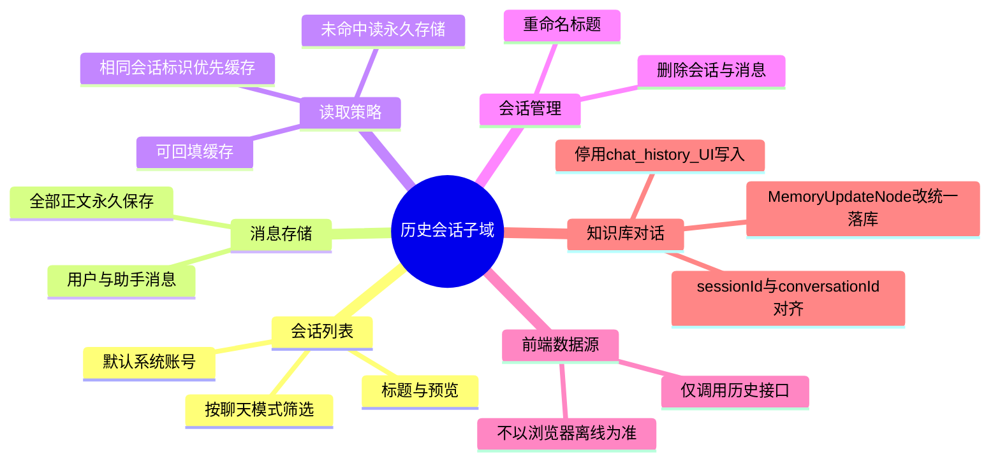

# 历史会话持久化

## Agent Hub / 历史会话 需求说明（前提/操作/结果）

> 覆盖 Nebula Desk 历史侧边栏，以及 **知识库对话接口**（`POST /api/agent-hub/chat/knowledge`）既有 UI 历史落库路径的统一改造。  
> 不覆盖 Graph 检索/生成主流程、`session_memory` 短期窗口、知识库上传。业务语言描述；技术选型见已归档 design。

---

## Requirements

### 功能组 1：历史会话列表

### Requirement: 1. 展示当前账号下的历史会话列表

系统应当（SHALL）为当前关联账号展示其全部已保存的历史会话列表；每条会话至少包含可识别的标题、最近预览、聊天模式及最近更新时间；用户可按聊天模式（如知识库对话、智能体对话等）筛选列表。

#### 场景: 进入工作台后加载历史列表
- **前提**：用户已打开对话工作台；后端存在至少一条属于当前默认账号的历史会话。
- **操作**：页面完成初始化或用户切换到对话视图。
- **结果**：系统从后端加载并展示历史会话列表，按最近更新时间排序；不依赖浏览器本地离线存储。

#### 场景: 按聊天模式筛选列表
- **前提**：历史列表中存在多种聊天模式的会话。
- **操作**：用户切换侧边栏当前聊天模式。
- **结果**：列表仅展示与当前模式匹配的历史会话；其他模式的会话不显示在当前列表中。

#### 场景: 无历史会话时的空状态
- **前提**：当前账号下尚无任何已保存的历史会话。
- **操作**：用户进入对话工作台并查看历史区域。
- **结果**：系统展示空状态提示，说明暂无历史会话；不展示可点击的历史条目。

---

### 功能组 2：消息永久存储

### Requirement: 2. 将会话的全部消息正文永久保存于后端

系统应当（SHALL）将历史会话中的用户消息与助手回复的**完整正文**持久保存于后端关系型数据库，作为该会话的权威数据源；不得仅保存摘要或截断片段作为唯一记录。

#### 场景: 用户发送消息后保存
- **前提**：用户处于某一会话中，并已输入用户消息。
- **操作**：用户发送该消息且系统接受发送。
- **结果**：该用户消息的正文被持久保存到该会话下；会话列表中的预览或更新时间随之更新。

#### 场景: 助手回复完成后保存
- **前提**：用户已发送消息，系统正以流式或其他方式生成助手回复。
- **操作**：助手回复生成完毕（含成功结束，不含仍进行中的中间态）。
- **结果**：助手回复的完整正文被持久保存到该会话下；会话元数据（如预览、更新时间）反映最新一轮对话。

#### 场景: 服务重启后数据仍可恢复
- **前提**：某会话此前已保存多条消息正文。
- **操作**：后端服务重启后，用户再次打开该会话。
- **结果**：系统仍能从永久存储中恢复该会话的全部已保存消息正文，与重启前一致。

---

### 功能组 3：相同会话再次访问时的读取策略

### Requirement: 3. 相同会话标识再次打开时缓存优先、永久存储兜底

当用户使用**与同一会话标识**再次进入会话或需要加载该会话已存在消息时，系统应当（SHALL）先尝试从会话消息热缓存读取；若缓存未命中，再从永久存储的历史消息表读取完整消息；允许在从永久存储命中后回填热缓存以加速后续访问。永久存储为权威数据源，热缓存不得作为唯一持久化手段。

#### 场景: 缓存命中时快速加载
- **前提**：该会话标识近期已被访问，且热缓存中仍保留其完整消息。
- **操作**：用户再次打开同一会话或继续在该会话中聊天。
- **结果**：系统从热缓存返回该会话的消息列表，用户可见与持久存储一致的已保存正文。

#### 场景: 缓存未命中时从永久存储加载
- **前提**：该会话标识在热缓存中不存在或已失效；永久存储中仍有该会话的消息。
- **操作**：用户再次打开该会话。
- **结果**：系统从永久存储加载该会话的全部已保存消息并展示；用户可见完整历史正文。

#### 场景: 从永久存储加载后加速后续访问
- **前提**：本次访问因缓存未命中而从永久存储加载了消息。
- **操作**：用户在短时间内再次打开同一会话。
- **结果**：系统可优先从热缓存返回消息，无需再次访问永久存储（在缓存有效期内）。

---

### 功能组 4：会话消息回放

### Requirement: 4. 选中历史会话后回放全部已保存消息

系统应当（SHALL）在用户从历史列表选中某条会话时，加载并展示该会话下全部已保存的消息正文，区分用户与助手角色，顺序与保存时一致。

#### 场景: 点击历史条目进入会话
- **前提**：历史列表中存在至少一条会话，且该会话下已保存消息。
- **操作**：用户点击某条历史会话。
- **结果**：主对话区展示该会话的全部已保存消息；当前活动会话标识与该历史会话一致。

#### 场景: 选中无消息的会话
- **前提**：历史列表中存在一条尚无已保存消息的会话（如刚创建）。
- **操作**：用户选中该会话。
- **结果**：主对话区为空或展示适当空状态；不展示其他会话的消息。

---

### 功能组 5：重命名历史会话

### Requirement: 5. 支持重命名历史会话标题且变更持久生效

系统应当（SHALL）允许用户对历史会话进行重命名；新标题须保存至后端并在列表与后续访问中持续生效，不得仅保存在浏览器本地。

#### 场景: 重命名成功
- **前提**：历史列表中存在一条可操作的会话。
- **操作**：用户发起重命名并提交有效的新标题。
- **结果**：列表与该会话详情中的标题更新为新名称；刷新页面或换设备后仍为该名称。

#### 场景: 提交空标题或无效标题
- **前提**：用户正在对某条会话进行重命名。
- **操作**：用户提交空标题或不符合规则的标题。
- **结果**：系统拒绝保存或回退为合理默认标题；原持久化标题不被破坏为空（具体规则见 design）。

---

### 功能组 6：删除历史会话

### Requirement: 6. 支持删除历史会话及其全部消息

系统应当（SHALL）允许用户删除一条历史会话；删除须同时移除该会话在永久存储中的全部消息及对应热缓存条目，删除后不可再通过历史接口恢复。

#### 场景: 删除非当前活动会话
- **前提**：历史列表中存在多条会话，用户选中删除其中一条非当前正在对话的会话。
- **操作**：用户确认删除该会话。
- **结果**：该会话从列表中消失；其消息不再可通过历史接口查询；其他会话不受影响。

#### 场景: 删除当前活动会话
- **前提**：用户正在某会话中对话，且该会话出现在历史列表中。
- **操作**：用户删除该会话。
- **结果**：该会话及消息从后端移除；界面切换到新会话或空会话状态，不再展示已删消息。

---

### 功能组 7：数据源与账号

### Requirement: 7. 历史数据以服务端为唯一数据源并挂接默认系统账号

系统应当（SHALL）以服务端历史接口与永久存储作为历史会话的**唯一**数据源；不得使用浏览器本地离线存储作为权威来源。本期无用户登录时，全部历史会话与消息挂接在**默认系统账号**下；数据模型须预留后续按真实用户隔离的扩展能力。

#### 场景: 换浏览器或清缓存后仍可访问历史
- **前提**：用户曾在某浏览器下产生并保存了历史会话。
- **操作**：用户使用另一浏览器或清空浏览器存储后访问同一部署环境。
- **结果**：仍可通过服务端加载同一默认账号下的历史列表与消息（与清缓存前一致，以服务端数据为准）。

#### 场景: 本期所有会话归属默认账号
- **前提**：系统尚未提供用户登录。
- **操作**：任意用户在同一部署环境下创建或访问历史会话。
- **结果**：读写均落在默认系统账号范围内；不实现按自然人用户的隔离（后续登录能力上线后另行演进）。

---

### 功能组 8：知识库对话历史落库统一

### Requirement: 8. 知识库对话接口的 UI 历史落库并入统一历史存储

系统应当（SHALL）将知识库对话（`POST /api/agent-hub/chat/knowledge`）流式完成后，用于侧边栏回放的历史消息写入与 Nebula Desk **同一套**历史会话永久存储；**不得**再继续向仅供 Knowledge Hub 使用的旧式「完整对话历史」表追加 UI 可见历史。知识库 Graph 的短期会话记忆（供多轮上下文检索）可保持独立，不在本需求中合并。

#### 场景: 知识库一轮对话完成后写入统一历史
- **前提**：用户处于知识库聊天模式，已发送用户消息并收到完整助手回复。
- **操作**：知识库对话流式处理完成，系统执行记忆更新环节。
- **结果**：该轮用户消息与助手正文写入统一历史存储，且会话标记为知识库模式；侧边栏可与其他模式会话一样查询与回放。

#### 场景: 知识库会话标识与前端一致
- **前提**：前端在知识库请求中携带会话标识（`conversationId` 或等价的 `sessionId`）。
- **操作**：用户在同一会话标识下连续多轮知识库对话。
- **结果**：各轮历史均落在同一会话下，不因服务端另生成标识而导致侧边栏出现重复会话或无法串联。

#### 场景: 停止向旧式完整对话历史表追加 UI 记录
- **前提**：知识库对话已完成且需持久化 UI 历史。
- **操作**：系统执行历史落库。
- **结果**：UI 可见历史仅进入统一历史存储；旧式「完整对话历史」表不再接收新的知识库 UI 历史记录。

---

### 功能组 9：变更范围边界

### Requirement: 9. 不改动对话编排主路径与短期/模型记忆

除知识库记忆更新环节中的 **UI 历史落库** 外，本变更不得改变 CompiledGraph 检索与生成、SSE 流式协议、智能体 Orchestrator 路由、需求开发流程、`session_memory` 短期窗口及模型侧 `ChatMemory` 的既有行为。

#### 场景: 知识库 SSE 与检索行为保持不变
- **前提**：用户通过知识库对话入口发起聊天。
- **操作**：用户发送消息并接收流式回复与元数据事件。
- **结果**：流式事件类型、结束条件与知识检索/生成主路径与变更前一致；仅历史落库落点发生变化。

#### 场景: 智能体与需求开发仅增加历史挂钩
- **前提**：用户通过智能体或需求开发入口发起聊天。
- **操作**：用户发送消息并接收流式回复。
- **结果**：编排逻辑不变；历史通过统一接口或前端挂钩写入，不改变 SSE 契约。

#### 场景: 历史与会话标识仅作关联
- **前提**：实时对话请求携带会话标识。
- **操作**：系统保存历史消息。
- **结果**：历史记录使用相同会话标识关联；不要求将历史表与 `session_memory` 或模型记忆存储合并为同一存储。
