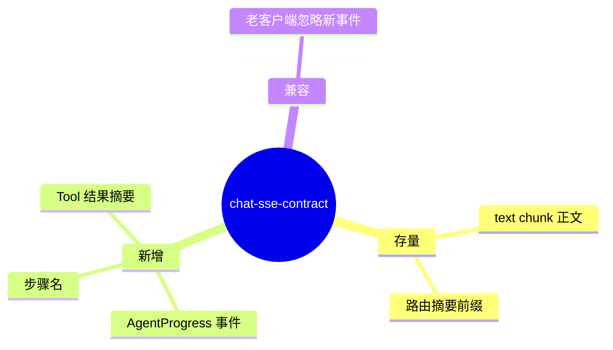

# SSE AgentProgress 契约

## Integration / 聊天 SSE 扩展 需求说明（前提/操作/结果）
> 在存量 SSE 文本流基础上，增加 AgentProgress 中间状态事件（当前步骤、思考链摘要、Tool 调用结果）；与 Nebula Desk 联调。
> 交付阶段：**P2**（协议定义 P2，前端 UI-FUNC 适配 uiCraftMode: auto）。
> 与 `aether-agent/agent-chat` 契约协同：正文流保持兼容，Progress 为增量事件。

---

## Requirements
（SSE 协议扩展）

### Requirement: 1. AgentProgress 事件格式 [P2]

系统 shall 在 Agent 执行过程中通过 SSE 推送结构化 AgentProgress 事件，至少含：eventType、stepName、status（running/completed/failed）、可选 thoughtSummary、toolResultSummary。

#### 场景: Tool 调用进度
- **前提**：子 Agent 执行 ReAct 调用查询订单 Tool。
- **操作**：监听 SSE 流。
- **结果**：先收到 Progress running「调用查询订单」；完成后 Progress completed 含结果摘要。

---

### Requirement: 2. 与正文流共存 [P2]

系统 shall 使 AgentProgress 事件与存量文本 chunk 在同一条 SSE 连接上交错推送；最终答案仍以文本 chunk 形式输出。

#### 场景: 老客户端兼容
- **前提**：前端仅解析 text 事件/纯文本 chunk。
- **操作**：后端推送 Progress + 正文。
- **结果**：老客户端仍显示正文；忽略未知事件类型不崩溃。

---

### Requirement: 3. 错误态 Progress [P2]

系统 shall 在步骤失败时推送 status=failed 的 Progress，含可读 errorMessage；随后正文流输出用户友好总结或降级提示。

#### 场景: Tool 超时
- **前提**：Tool 调用超时。
- **操作**：监听 SSE。
- **结果**：Progress failed 含步骤名与超时说明；正文含友好提示。

---

### Requirement: 4. chat/agent 路径保持非 BREAKING [P1]

系统 shall 使未订阅 Progress 的调用方在 `POST /api/agent-hub/chat/agent` 上仍获得与重构前等价的成功路径 SSE 正文行为；Progress 为可选增强。

#### 场景: 仅要最终答案
- **前提**：客户端不解析 Progress。
- **操作**：完整一轮对话。
- **结果**：收到完整流式正文；HTTP 契约不变。

---

### Requirement: 5. Artifact 结构化 SSE 事件 [P4]

系统 shall 在 SuperAgents SSE 流中推送 type=artifact 的结构化事件；payload 须符合 `aether-integration/chat-artifacts` 定义的 artifact 契约，至少含 id、kind、title、content 或 typed payload。

#### 场景: text2sql 推送 SQL 与表格 artifact
- **前提**：text2sql 完成草案生成与查询执行。
- **操作**：监听 `POST /api/super-agents/chat` SSE。
- **结果**：流中除 token/progress 外，出现 artifact 事件；客户端可据此渲染 SQL 卡片与结果表格。

---

### Requirement: 6. Artifact 与 token/progress 非 BREAKING 共存 [P4]

系统 shall 使 artifact 事件与存量 token、progress 事件在同一条 SSE 连接上共存；未订阅 artifact 的调用方仍须获得等价可读 token 正文，HTTP 路径与成功语义不变。

#### 场景: 仅解析 token 的客户端
- **前提**：客户端未实现 artifact 解析。
- **操作**：完成含 artifact 的 SuperAgents 对话。
- **结果**：仍收到完整 token 正文；忽略 artifact 事件不崩溃；与 REQ-4 非 BREAKING 原则一致。

---
