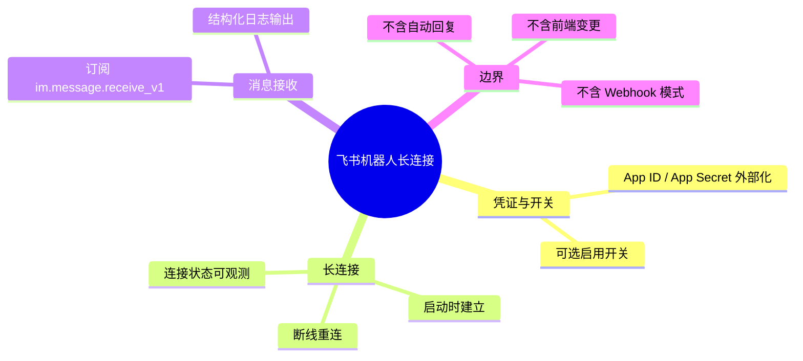

# 飞书机器人-长连接消息接收

## 集成/飞书 需求说明（前提/操作/结果）
> 本能力使 AetherStack 后端通过飞书官方 SDK 以**长连接（WebSocket）**模式接收机器人消息。
> MVP 阶段仅验证连通性与入站消息可观测性：收到消息后输出结构化日志，不做自动回复与 Agent 编排。
> 规范仅描述业务口径与边界，不包含 SDK 类名、包路径等技术实现细节。

---

## Requirements

### 功能组 1：飞书应用凭证与启用开关

### Requirement: 1. 飞书应用凭证通过外部配置注入

系统应当（SHALL）通过外部配置（环境变量或本地配置文件）读取飞书应用的 App ID 与 App Secret；禁止在代码或版本库中硬编码凭证。

#### 场景: 配置完整且启用飞书集成
- **前提**：运维已正确设置 `feishu.app-id` 与 `feishu.app-secret`（或等价环境变量）；飞书集成功能处于启用状态。
- **操作**：应用启动。
- **结果**：系统成功加载飞书凭证，并进入长连接初始化流程。

#### 场景: 凭证缺失
- **前提**：飞书集成处于启用状态，但 App ID 或 App Secret 未配置或为空。
- **操作**：应用启动。
- **结果**：系统不建立飞书长连接；输出明确的配置缺失告警日志；应用其余功能不受影响，正常启动。

#### 场景: 飞书集成被关闭
- **前提**：飞书启用开关（如 `feishu.enabled=false`）处于关闭状态。
- **操作**：应用启动。
- **结果**：系统跳过飞书 SDK 初始化与长连接建立；不输出凭证相关错误；应用其余功能正常启动。

---

### 功能组 2：长连接建立与生命周期

### Requirement: 2. 应用启动时建立飞书长连接

系统应当（SHALL）在飞书集成启用且凭证配置完整时，于应用启动阶段初始化飞书 SDK 并建立长连接（WebSocket），订阅机器人消息相关事件（至少包含 `im.message.receive_v1`）。

#### 场景: 启动后成功建立长连接
- **前提**：飞书集成已启用；凭证配置完整；飞书开放平台侧机器人与事件订阅已正确配置。
- **操作**：应用启动完成。
- **结果**：系统与飞书平台建立长连接；输出连接成功或就绪状态的结构化日志。

#### 场景: 启动时连接失败
- **前提**：飞书集成已启用；凭证配置完整；但网络不可达或飞书侧暂时不可用。
- **操作**：应用启动并尝试建立长连接。
- **结果**：系统输出连接失败的结构化错误日志（含失败原因摘要）；应用不因飞书连接失败而整体崩溃；其余业务功能可正常使用。

---

### Requirement: 3. 长连接断线后自动重连

系统应当（SHALL）在飞书长连接意外断开时，按合理策略尝试自动重连，并在重连过程中输出可追踪的状态日志。

#### 场景: 连接意外断开后重连成功
- **前提**：飞书长连接曾处于已连接状态；因网络抖动等原因连接断开。
- **操作**：系统检测到断线并触发重连。
- **结果**：系统输出断线与重连尝试日志；重连成功后输出连接恢复日志；后续可继续接收消息。

#### 场景: 重连持续失败
- **前提**：飞书长连接断开；飞书平台或网络长时间不可用。
- **操作**：系统多次尝试重连均失败。
- **结果**：系统按策略继续重试或退避重试，并输出失败摘要日志；应用主进程保持运行；网络恢复后应能重新建立连接。

---

### 功能组 3：消息接收与结构化日志

### Requirement: 4. 收到飞书机器人消息后输出结构化日志

系统应当（SHALL）在通过长连接收到飞书机器人消息事件时，输出结构化日志，至少包含：事件类型、消息 ID、发送者标识、消息类型；若为文本消息，应包含文本内容摘要。本阶段不对消息做业务处理或自动回复。

#### 场景: 收到单聊文本消息
- **前提**：飞书长连接处于已连接状态；用户在飞书私聊中向机器人发送一条文本消息。
- **操作**：飞书平台推送 `im.message.receive_v1` 事件。
- **结果**：系统输出结构化日志，包含事件类型、消息 ID、发送者、消息类型及文本内容；不自动回复用户。

#### 场景: 收到群聊 @ 机器人消息
- **前提**：飞书长连接处于已连接状态；用户在群聊中 @ 机器人并发送消息。
- **操作**：飞书平台推送消息接收事件。
- **结果**：系统输出结构化日志，包含事件类型、消息 ID、发送者、消息类型及可识别的内容摘要；不自动回复。

#### 场景: 收到非文本消息
- **前提**：飞书长连接处于已连接状态；用户向机器人发送图片、文件等非纯文本消息。
- **操作**：飞书平台推送消息接收事件。
- **结果**：系统输出结构化日志，包含事件类型、消息 ID、发送者及消息类型；日志中标注为非文本类型，不因无法解析文本而抛错中断连接。

---

### 功能组 4：可观测性与安全边界

### Requirement: 5. 飞书集成过程具备可观测性且日志不含敏感凭证

系统应当（SHALL）对飞书长连接的关键生命周期节点（初始化、连接成功、断线、重连、消息接收计数或摘要）输出可检索的结构化日志；日志中不得输出 App Secret 等敏感凭证的明文。

#### 场景: 连接生命周期日志可检索
- **前提**：飞书集成已启用且凭证完整。
- **操作**：应用经历启动连接、正常运行、断线、重连等过程。
- **结果**：每个关键节点均有对应结构化日志，便于运维排查；日志字段稳定、可过滤（如按 `feishu` 或等价标识）。

#### 场景: 日志不泄露凭证
- **前提**：飞书集成正常运行并接收消息。
- **操作**：系统输出任意飞书相关日志。
- **结果**：日志内容不包含 App Secret 明文；若需标识应用，仅使用 App ID 或脱敏摘要。

#### 场景: 本阶段不做业务转发
- **前提**：系统已成功接收飞书消息并打印日志。
- **操作**：消息到达后系统处理完毕。
- **结果**：消息不被转发至 Agent Hub 编排、不触发 LLM 调用、不持久化入库；仅完成日志记录即结束本阶段处理。

---
